# 🕵️‍♀️ Deepfake Image Detection System

A deep learning-based system to detect deepfake (AI-manipulated) images by comparing a **custom CNN** against a **fine-tuned EfficientNet-B3** model, deployed through an interactive **Streamlit** web interface.


**Team:**
- Aliha Asif (FA23-BSE-092)
- Fakiha Zahoor (FA23-BSE-137)
- Ariba Amir (FA23-BSE-138)
- Laiba Sultan (FA23-BSE-142)

---

## 📌 Abstract

With the rapid rise of AI-generated visual content, distinguishing real images from manipulated ones has become increasingly difficult. This project implements and compares two deep learning classification models — a custom CNN trained from scratch and a fine-tuned EfficientNet-B3 using transfer learning — for deepfake image detection. Both models are evaluated using accuracy, loss curves, confusion matrices, and classification reports, and deployed via a Streamlit web app that lets users upload an image and instantly view predictions with confidence scores from both models.

---

## 🎯 Objectives

- Build an automated deepfake detection system.
- Compare a CNN trained from scratch vs. a fine-tuned EfficientNet-B3.
- Evaluate performance using accuracy, precision, recall, F1-score, and confusion matrices.
- Provide a simple, user-friendly web interface for real-time predictions.

---

## 🏗️ System Design


### Data Flow Diagram
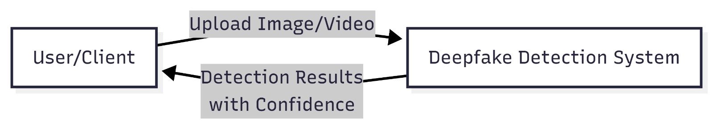


---

## ⚙️ Methodology

1. **Data Collection & Preprocessing** – Resize to 224×224, normalize pixel values, convert to tensors.
2. **Model Training**
   - Custom CNN designed and trained from scratch.
   - EfficientNet-B3 fine-tuned using transfer learning.
3. **Evaluation** – Accuracy, Precision, Recall, F1-score, Confusion Matrix on validation & test sets.
4. **Deployment** – Streamlit frontend for uploading images and viewing predictions from both models side-by-side.

---

## 🧪 Implementation Screenshots

### EfficientNet-B3

**Train Output**
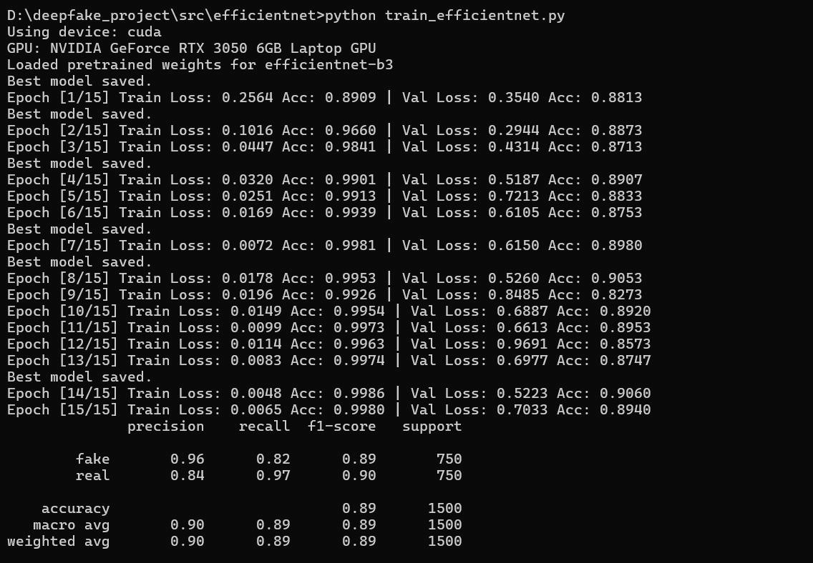

**Validation Output**
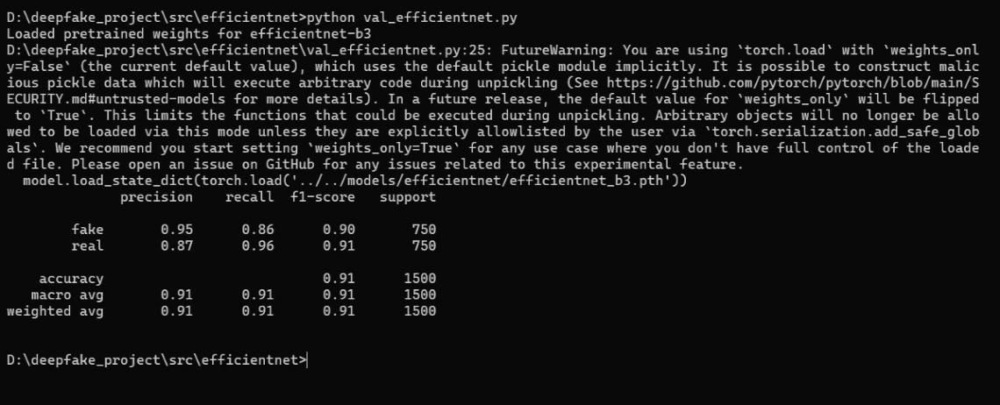

**Test Output**
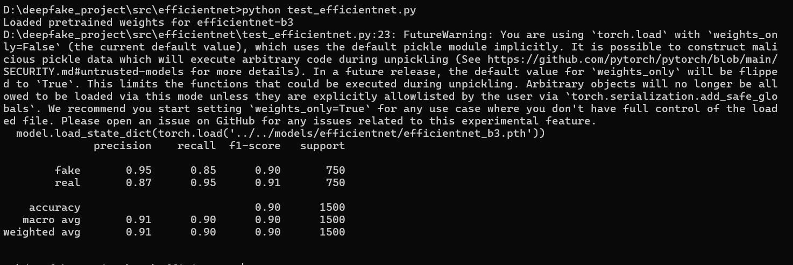

### Custom CNN

**Train Output**
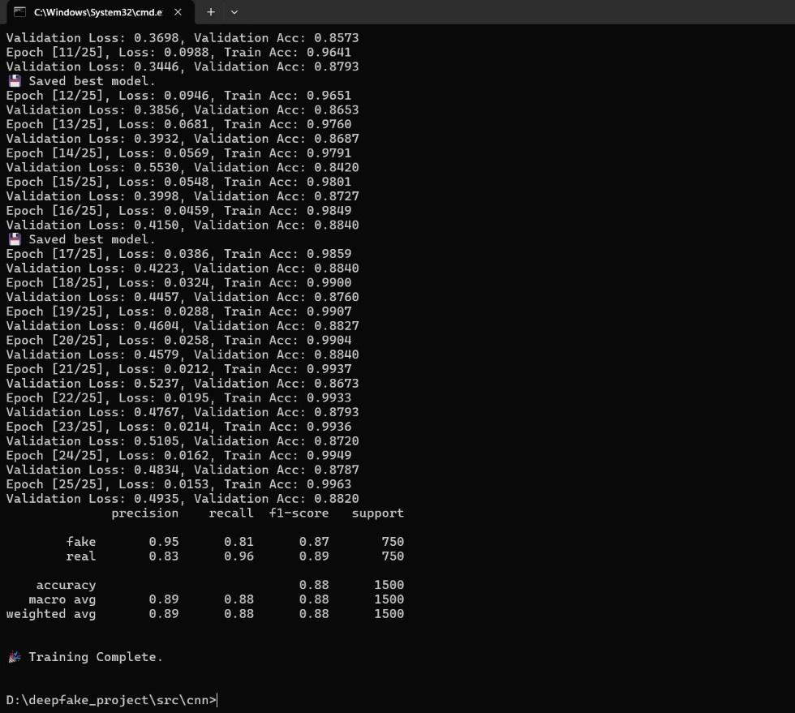

**Validation Output**
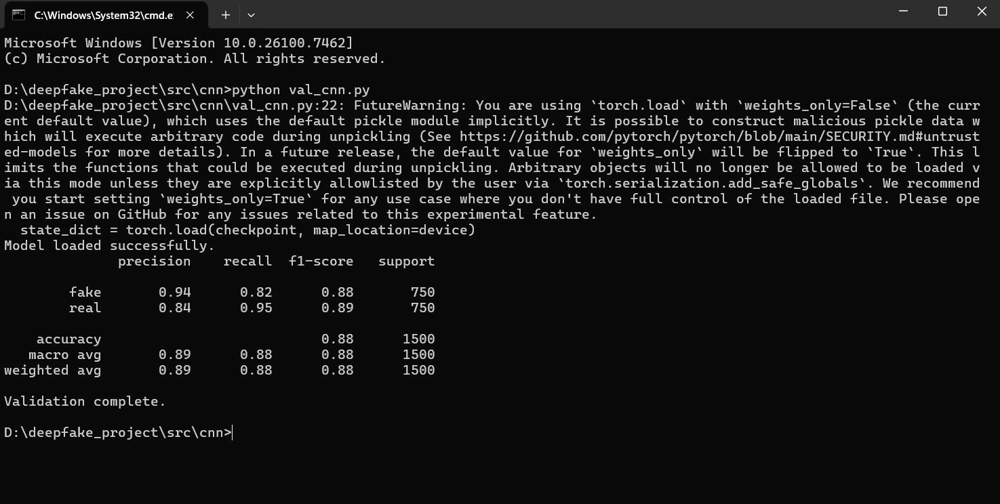

**Test Output**
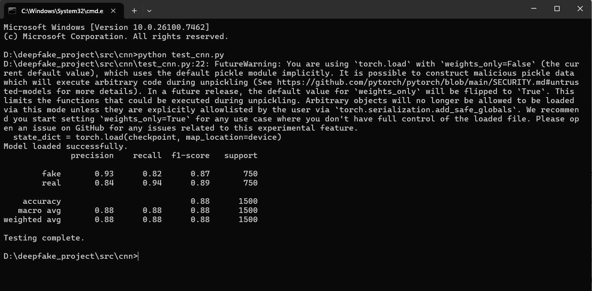

---

## 📊 Results

### Loss & Accuracy Curves

| CNN | EfficientNet-B3 |
|---|---|
| 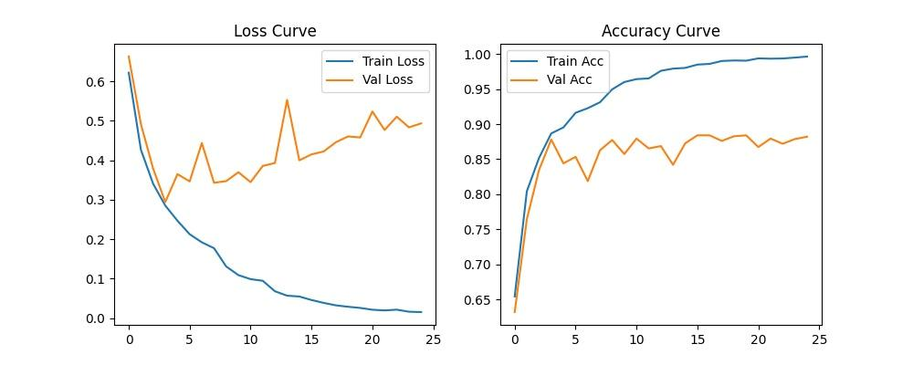 | 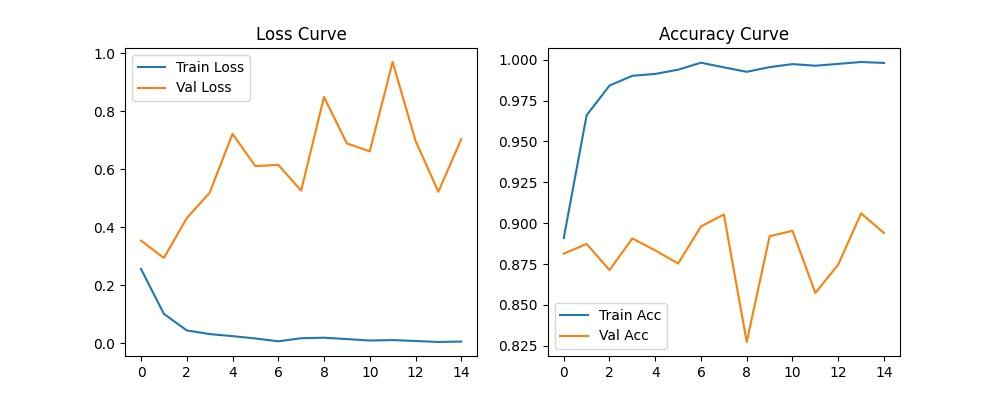 |

### Confusion Matrices

| | Validation | Testing |
|---|---|---|
| **CNN** |  | 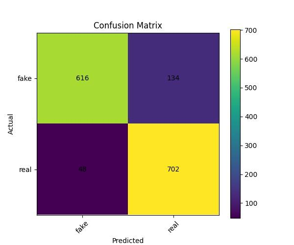 |
| **EfficientNet-B3** |  |  |

### Model Comparison

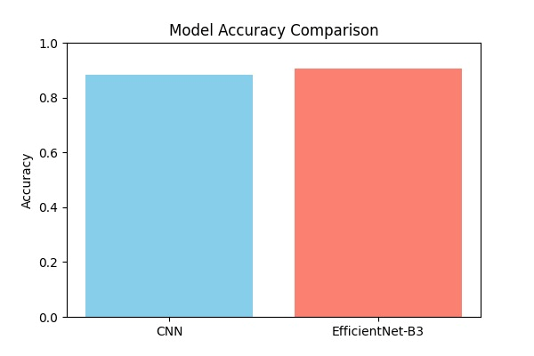

EfficientNet-B3 achieved higher accuracy and stronger generalization compared to the custom CNN architecture.

---

## 🛠️ Tech Stack

- **Language:** Python
- **Deep Learning Framework:** PyTorch, `efficientnet_pytorch`
- **Image Processing:** PIL, OpenCV, torchvision
- **Evaluation:** Scikit-learn, Matplotlib
- **Frontend:** Streamlit

## 💻 Hardware Requirements

- CPU: Intel Core i5 or higher
- GPU: NVIDIA GeForce GTX 1050+ (CUDA support recommended)
- RAM: 16 GB minimum
- Storage: 500 GB HDD/SSD

---

## 📂 Project Structure

```
deepfake_project/
├── src/
│   ├── cnn/                # Custom CNN model, train/val/test scripts
│   └── efficientnet/       # EfficientNet-B3 model, train/val/test scripts
├── models/                 # Saved model weights & training history
├── comparison/             # Confusion matrices & comparison plots
├── dataset/                # Train/val/test image folders
├── frontend/                # Streamlit app
├── images/                 # README screenshots (this folder)
└── README.md
```

---

## 🚀 Running the Project

```bash
# Install dependencies
pip install torch torchvision efficientnet_pytorch streamlit matplotlib scikit-learn opencv-python pillow

# Train models
python src/cnn/train_cnn.py
python src/efficientnet/train_efficientnet.py

# Launch the web app
streamlit run frontend/app.py
```

---

## 🔮 Future Work

- Real-time video deepfake detection.
- Ensemble techniques combining both models.
- Adversarial training for robustness against sophisticated forgeries.
- Expanding dataset diversity for better generalization.
